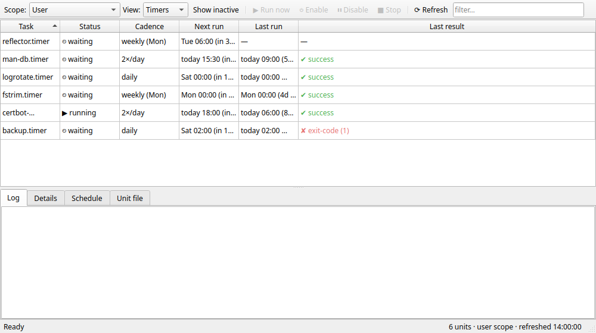

# Task Deck

A native Linux desktop GUI for systemd timers and services — the missing
"Task Scheduler" panel: what's scheduled, how often, when it runs next, when it
last ran, whether it worked, and its logs. Built with PySide6/Qt Widgets.

- **At a glance:** status, cadence (daily / weekly / 2×/day / boot+12h …), next
  run, last run, and last result for every timer and service.
- **User instance:** full view plus run-now / enable / disable / stop.
- **System instance:** read-only view — by design, the app never asks for root.
- **Per-unit detail:** journal log, `systemctl show` properties, effective
  schedule (drop-ins included), and the unit file.

No web stack, no daemon, no polkit — just `systemctl`/`journalctl` shelled out
asynchronously and a Qt table.

## Run

    sudo dnf install python3-pyside6
    python3 -m taskdeck

## Install (Start menu, KRunner search, taskbar pinning)

    ./install.sh

A user-local install (no root): it drops a launcher at `~/.local/bin/taskdeck`,
the icon under the hicolor theme, and a `.desktop` entry in
`~/.local/share/applications/`. The app still runs from this repo in place — the
launcher just records where the repo is, so the menu entry keeps working even if
you move the checkout (re-run `./install.sh` after a move). `./uninstall.sh`
removes all three and leaves the repo untouched.

## Background monitoring (tray)

When a system tray is available, Task Deck lives in the tray and watches your
user services in the background — even with the window closed — and pops a
desktop notification when a service enters the `failed` state (failures only, no
noise). Anything already failed at login is surfaced once, as a summary.

- Closing the window hides it to the tray; the monitor keeps watching. **Quit**
  in the tray menu is the only thing that exits.
- Left-click the tray icon to show/hide the window.
- **Start at login** in the tray menu toggles an autostart entry, so Task Deck
  comes up to the tray when you log in.

Start hidden in the tray with `taskdeck --tray` (what the autostart entry uses).

## Develop

    sudo dnf install python3-pytest-qt ruff python3-mypy
    python3 -m pytest                  # hermetic suite (offscreen Qt, no real systemd)
    python3 -m pytest -m realsystemd   # read-only checks against the live user instance
    ruff check . && mypy taskdeck

`python3 tools/screenshot.py` regenerates the image above from the real widget.
